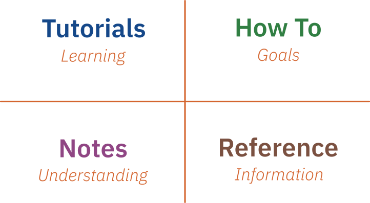

# Documentation Structure

The documentation for this site is organised using the [Diátaxis](https://diataxis.fr/) documentation framework, to give four _types_ of documentation as summarised in the figure below. Structuring the documentation in this way is intended to help you find the most appropriate resources: both for the completing the site tasks and working your way through the topics we will cover. The different sections are also colour-coded to help orient you where you are, and organise your own notes.

{: .width_75 }

The heart of the site are the All _Tutorials_{: .blue}: which will be the main focus for the labs in this site

- All **Tutorials**{: .blue} have a series of _learning outcomes_, which will relate to the overall learning outcomes of the site. At the end of each _Workshop_{: .blue} you should have achieved a something that relates concretely to the overall topic and goal of the site. However the _Tutorials_{: .blue} is also a _pathway_: you will begin with relatively little experience of the topic, idea, or skill. And should end with something to show that helps you to build your own understanding.

  However a _Tutorial_{: .blue} will not cover _everything_ you need to complete the site. Also, you will need other kinds of resources to help you complete the _Tutorials_{: .blue}. Those other resources are

- **How-To**{: .green} guides can be found in most _Tutorials_{: .blue}: they help you to achieve a specific _goal_, usually in a step-by-step manner. _How-To_{: .green} guides also do not give _Notes_{: .violet} explaining '_why_' things are done in a certain way, or provide a _Reference_{: .brown} to related material --- although they may link to these. Instead the aim of a _How-To_{: .green} guide is to answer questions as "_how do I do **x**?_" or "_what code should I use to achieve **y**_?

  Often a _Tutorial_{: .blue} will introduce a specific _How-To_{: .green}: but it is up to you how much of it you use later. You may, for instance, choose to make you own notes of how to achieve a specific goal --- indeed these is strongly encouraged. Or you may find some _How-To_{: .green}'s setting up environment something you refer back to frequently.

- **Notes**{: .violet} provide the background '_why_' for a specific _How-To_{: .green} or _Tutorial_{: .blue}. _Notes_{: .violet} should provide a deeper understanding of a topic: but they won't tell you '_how_' to do something. Most _Tutorials_{: .blue} will have **Notes**{: .violet} giving the context, background, theory, or history of the topic being introduced in that activity. _Notes_{: .violet} will also link back to, or summarise, the content from lectures or other material to help you gain a full understanding of the site content.

- Finally, **Reference**{: .brown} material provides the basic facts you will need in other activities. Examples of _Reference_{: .brown} material are links to the API or source code for a specific library, data-sheets for components or other devices, and papers and books from the academic literature expanding on a specific topic or area. This allows you explore the summary outlined in a Note{: .violet}: or to understand the specific technique introduced in a _How-To_{: .green} in more detail.

You will need different kinds of documentation at different times: and you may use some types of documentation more frequently. For instance we expect you will only go through each _Tutorial_{: .blue} once --- but you may refer to the _How-To_{: .green} guides within the _Tutorials_{: .blue} more frequently. So we have also collected the various types of documentation together, to make it easier to go back to a specific piece of material more easily. If you can't find something, though, ask your site tutor for help.
